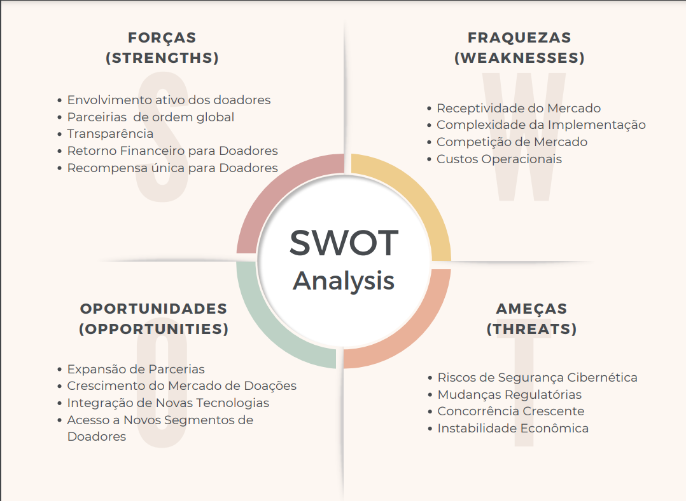
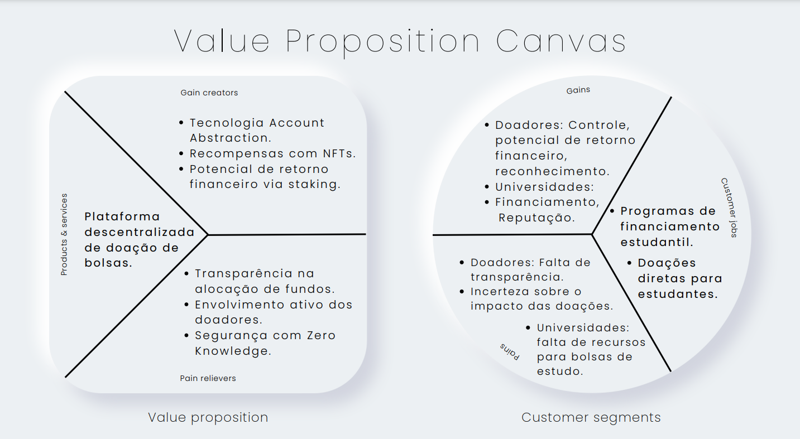
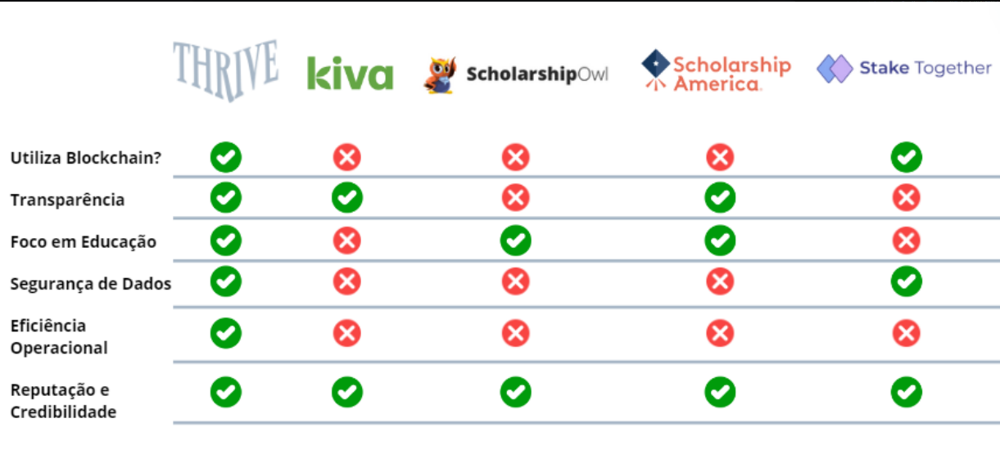
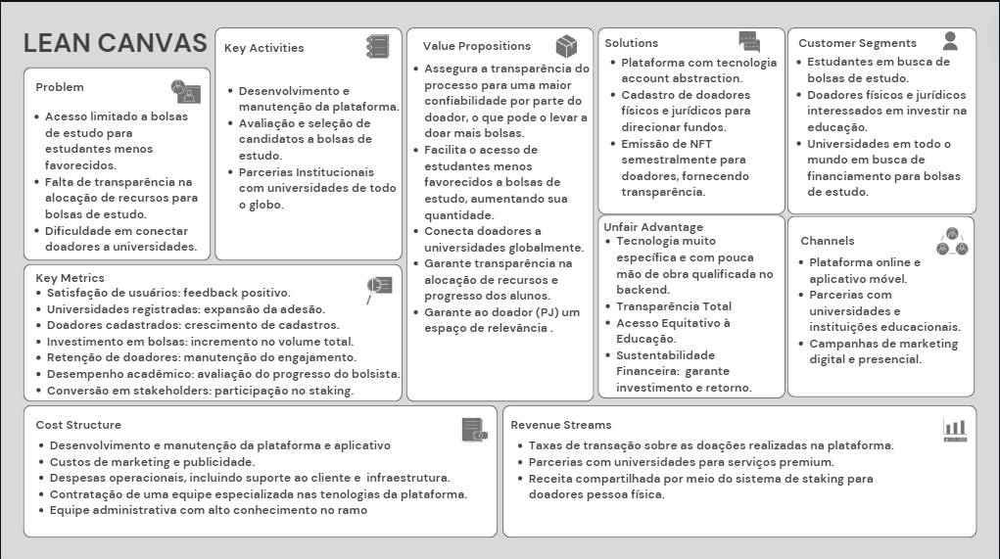

# Thrive

   

 

&nbsp;&nbsp;&nbsp;&nbsp;A thrive é uma plataforma que se utiliza da tecnologia account abstraction, na qual as universidades teriam a possibilidade de criar perfis para receberem investimentos destinados a bolsas de estudos. A plataforma possibilita o cadastro de doadores físicos e jurídicos que seriam capazes de direcionar fundos para a universidade que os alocaria da melhor forma para seus alunos de acordo com seu desempenho acadêmico e desenvolvimento de soft skills.

## Sumário

[1. Cenário Global](#c1)

[2. Análise de Mercado](#c2)

[2.1. Análise SWOT](#c3)

[2.2. Canvas de Proposta de Valor](#c4)

[2.3. Análise de Benchmarking](#c5)

[2.4. Lean Canvas](#c6)

[Nosso Time](#cx)

##  1. Cenário Global
&nbsp;&nbsp;&nbsp;&nbsp;No panorama educacional global, uma grande quantidade de atores e estruturas desempenham papéis cruciais na promoção do acesso à educação e no desenvolvimento dos estudantes. Desde a educação inicial até o ensino superior, o sistema educacional mundial é uma rede complexa de instituições, governos, professores e alunos, todos buscando realizar o direito universal à educação.

&nbsp;&nbsp;&nbsp;&nbsp;Na base da pirâmide educacional estão a educação primária e secundária, estágios fundamentais para o crescimento cognitivo e social das crianças e adolescentes. Nessa fase que os fundamentos são estabelecidas para suas jornadas educacionais, preparando-os não apenas para o próximo nível de ensino, mas também para a vida além das salas de aula.

&nbsp;&nbsp;&nbsp;&nbsp;Organizações internacionais, como a UNESCO e o Banco Mundial, desempenham um papel crucial na definição de políticas e na alocação de recursos para promover a educação em todo o mundo. No entanto, apesar dos esforços, desafios persistentes, como a falta de acesso a recursos educacionais adequados e a desigualdade socioeconômica dos países. Tal desparidade é observável na D.I.T, onde os países do Sul se inserem de forma mais demorada no âmbito da inovação tecnológica, ficando com uma defasagem enorme e atuando como fornecedores de matéria-prima. Essas problemáticas continuam a ser obstáculos significativos para o pleno desenvolvimento do sistema educacional global.

&nbsp;&nbsp;&nbsp;&nbsp;Escolas públicas e privadas desempenham papéis distintos em diferentes partes do mundo. Enquanto as primeiras buscam oferecer uma educação gratuita e acessível para todos, as privadas muitas vezes possuem recursos superiores e podem proporcionar uma educação mais personalizada, embora o faça por meio de mensalidades.

&nbsp;&nbsp;&nbsp;&nbsp;Professores são os pilares da educação em todos os lugares, responsáveis por transmitir conhecimento, habilidades e valores aos estudantes. No entanto, enfrentam desafios semelhantes em muitos países, incluindo baixos salários, falta de recursos e condições de trabalho precárias, que se agravam em países emergentes.

&nbsp;&nbsp;&nbsp;&nbsp;Os estudantes, independentemente de sua origem ou localização geográfica, compartilham desafios comuns em suas jornadas educacionais. Desde a falta de acesso a materiais educacionais até a pressão por desempenho acadêmico, eles enfrentam obstáculos que podem afetar seu progresso e desenvolvimento.

&nbsp;&nbsp;&nbsp;&nbsp;Neste contexto global, unindo esforços da comunidade global e o potencial da tecnologia, surgem iniciativas que visam, não apenas fornecer apoio financeiro aos estudantes, mas promover uma educação mais inclusiva e acessível para todos, sem depender de sua origem ou condição socioeconômica. O que é um avanço significativo em direção à construção de um sistema educacional global mais justo e equitativo.

##  2. Análise de Mercado

&nbsp;&nbsp;&nbsp;&nbsp;À partir da análise do problema, valemos-se de algumas ferramentas para identificar o mercado no qual estamos inseridos e, assim, fazer um posicionamento estrátégico, apresentando uma proposta de valor única e etendendo o que nosso cliente realmente precisa. Além disso foi possível entender os riscos e ameaças que estão rodeiam a solução, assim pode-se preparar meelhor para eventualidades. Segue uma descrição de cada uma e seus respectivos templates.

###  2.1. Análise SWOT
&nbsp;&nbsp;&nbsp;&nbsp;A matriz SWOT é uma ferramenta de planejamento estratégico que ajuda as empresas na tomada de decisão. Esta metodologia divide-se em aspectos internos e externos, compreendendo forças (strengths) e fraquezas (weaknesses) para o ambiente interno, e oportunidades (opportunities) e ameaças (threats) para o externo, que têm por objetivo identificar os principais pontos de influência que afetam a empresa para uma clareza melhor de quais são os fatores que estão sob seu controle (internos) e os que não estão (externos).

&nbsp;&nbsp;&nbsp;&nbsp;Os aspectos externos se situam na esfera do que é praticamente incontrolável pela empresa, ao dependerem do meio em que ela está inserida e até mesmo, algumas vezes, do ambiente global. Desse modo, oportunidades são transformações que ocorrem no mercado e podem ser aproveitadas pela empresa pela tomada de um posicionamento mais favorável diante do que está ocorrendo. Em contrapartida, surgem as ameaças, as quais são fatores exógenos que colocam a empresa em uma situação de risco ou proporcionam maiores desafios para um bom desempenho mercantil.

&nbsp;&nbsp;&nbsp;&nbsp;Por outro lado, os fatores internos referem-se à esfera sob controle direto da empresa, ou seja, ela pode, no caso de fraquezas, tomar atitudes a fim de saná-los, ou potencializá-los, no caso de forças. Neste contexto, as forças correspondem a elementos que conferem vantagens competitivas perante os concorrentes, mas que sejam tão distintiva quanto possível em relação aos competidores para que, deste modo, possam representar um grande diferencial da empresa. Enquanto as fraquezas representam limitações ou desvantagens que fragilizam a corporação, prejudicam a dinâmica do negócio e seu posicionamento estratégico no mercado (FERNANDES, Djair 2012).

   

 

&nbsp;&nbsp;&nbsp;&nbsp;Com esssa análise pudemos entender os principais pontos fortes fracos de nosssa proposta e as ameaças ou oportunidades presentes no mercado, assim é possível montar um planejamento estratégico e, entendendo melhor as fraquezes, trabalhar na mitigação de ineficiências do nosso projeto.

###  2.2. Canvas de Proposta de Valor

&nbsp;&nbsp;&nbsp;&nbsp;Um Canvas de Proposta de Valor é basicamente um mapa visual que ajuda a entender melhor o que torna um produto ou serviço valioso para os clientes. Imagine como um guia que organiza informações importantes sobre quem são seus clientes, o que eles precisam, e como seu produto ou serviço resolve seus problemas ou traz benefícios. É como uma caixa de ferramentas que permite às equipes reunirem suas ideias e pensarem de forma criativa sobre como podem oferecer algo especial aos clientes.

&nbsp;&nbsp;&nbsp;&nbsp;Usar um Canvas de Proposta de Valor é como criar uma história sobre como seu produto ou serviço faz a diferença na vida das pessoas. É uma conversa visual que ajuda as equipes a se concentrarem no que realmente importa: entender as necessidades dos clientes e encontrar maneiras inteligentes de atendê-las. É uma abordagem colaborativa que incentiva todos a contribuírem com suas ideias, garantindo que todos estejam na mesma página e trabalhando na mesma direção para oferecer algo que realmente importa para os clientes.

   

 

&nbsp;&nbsp;&nbsp;&nbsp;A partir do nosso Canvas de Proposta de Valor (CPV), determinamos essencialmente como o nosso produto ou serviço cria valor para os clientes. Isso inclui entender quem são os nossos clientes-alvo, quais são suas necessidades e desejos, e como o produto ou serviço oferecido atende a essas necessidades de uma forma única e convincente. Além disso, o CPV também nos ajuda a identificar como o nosso produto ou serviço se diferencia da concorrência e quais são os principais benefícios percebidos pelos clientes. 

###  2.3. Análise de Benchmarking
&nbsp;&nbsp;&nbsp;&nbsp;O objetivo do benchmarking é identificar oportunidades de melhoria, entender onde a organização se posiciona em relação aos concorrentes ou referências do setor e buscar maneiras de implementar mudanças positivas para aumentar a eficiência, qualidade e competitividade.

&nbsp;&nbsp;&nbsp;&nbsp;Considerando a proposta da Thrive, nós realizamos um Benchmarking para identificar os principais pontos com relação a como outras empresas se posicionam no mercado. Nossa análise considerou 8 pontos: Tecnologia Utilizada, Transparência e Prestação de Contas, Acesso Equitativo à Educação, Sustentabilidade Financeira, Segurança de Dados, Impacto Social, Eficiência Operacional e Reputação e Credibilidade. Comparamos a Thrive com a Kiva, ScholarshipOwl, Scholarship America e Stake Together.

**Tecnologia Utilizada:**
- Thrive: Utiliza blockchain com account abstraction, proporcionando eficiência e segurança.
- Kiva: Usa uma plataforma online tradicional.
- ScholarshipOwl: Utiliza uma plataforma online tradicional.
- Scholarship America: Utiliza plataformas online tradicionais.
- Stake Together: Utiliza blockchain para facilitar o financiamento coletivo.

**Transparência e Prestação de Contas:**
- Thrive: Oferece transparência total sobre o uso dos fundos.
- Kiva: Possui um alto nível de transparência.
- ScholarshipOwl: Transparência variável dependendo da plataforma específica.
- Scholarship America: Mantém um alto nível de transparência.
- Stake Together: Transparência variável dependendo da campanha.

**Acesso Equitativo à Educação:**
- Thrive: Foca em jovens da periferia.
- Kiva: Concentra-se principalmente em micro finanças para empreendedores em países em desenvolvimento.
- ScholarshipOwl: Oferece acesso a bolsas de estudo para uma ampla gama de estudantes.
- Scholarship America: Oferece uma variedade de programas de bolsas de estudo.
- Stake Together: Varia dependendo da campanha de financiamento.

**Sustentabilidade Financeira:**
- Thrive: Implementa staking para doadores pessoa física.
- Kiva: Depende de financiamento externo.
- ScholarshipOwl: Depende de receitas geradas pelas taxas dos serviços.
- Scholarship America: Depende de doações e financiamento externo.
- Stake Together: Depende do sucesso das campanhas de financiamento coletivo.

**Segurança de Dados:**
- Thrive: Utiliza tecnologias avançadas como Zero Knowledge para proteger os dados dos alunos.
- Kiva: Implementa medidas de segurança padrão para proteger os dados dos usuários.
- ScholarshipOwl: Depende da segurança das plataformas online utilizadas.
- Scholarship America: Implementa medidas de segurança padrão para proteger os dados dos alunos.
- Stake Together: Dependente da segurança da blockchain e dos sistemas de pagamento utilizados.

**Impacto Social:**
- Thrive: Foca em fornecer acesso à educação de qualidade para jovens da periferia.
- Kiva: Centra-se em fornecer microcréditos para empreendedores em países em desenvolvimento.
- ScholarshipOwl: Facilita o acesso a bolsas de estudo para estudantes em geral.
- Scholarship America: Oferece uma variedade de programas de bolsas de estudo.
- Stake Together: Varia dependendo do propósito das campanhas de financiamento coletivo.

**Eficiência Operacional:**
- Thrive: Processo automatizado de seleção e alocação de bolsas de estudo e investimentos.
- Kiva: Depende de agentes locais para facilitar os empréstimos.
- ScholarshipOwl: Depende de processos manuais para revisar e conceder bolsas de estudo.
- Scholarship America: Utiliza processos tradicionais de seleção e concessão de bolsas de estudo.
- Stake Together: Depende da eficácia das campanhas de financiamento coletivo e do suporte fornecido.

**Reputação e Credibilidade:**
- Thrive: A reputação e credibilidade estão em desenvolvimento.
- Kiva: Possui uma boa reputação global.
- ScholarshipOwl: Varia dependendo da experiência do usuário.
- Scholarship America: Possui uma reputação sólida.
- Stake Together: Varia dependendo do histórico das campanhas de financiamento e da percepção dos doadores.

&nbsp;&nbsp;&nbsp;&nbsp;Analisando esses pontos, nós conseguimos chegar na tabela a seguir:

   

 

&nbsp;&nbsp;&nbsp;&nbsp;É possível identificar que a Thrive possui uma plataforma mais transparente e segura do que as outras já existentes no mercado, além disso, apresenta uma eficiência operacional maior por ser um processo automatizado. O principal ponto que seria um problema para a Thrive é a falta de reputação e credibilidade, porém ela se sobressai dessa situação ao realizar a parceria com as universidades estabelecendo uma conexão e validando a nossa reputação.

###  2.4. Lean Canvas

&nbsp;&nbsp;&nbsp;&nbsp;O Lean Canvas é uma ferramenta simplificada de planejamento estratégico, especialmente útil para startups e projetos em estágios iniciais. No contexto do Lean Canvas de Proposta de Valor, o objetivo é destacar os principais elementos da proposta de valor de um produto ou serviço de forma concisa e direta. O canvas é dividido em nove blocos, que capturam os aspectos essenciais do negócio, como os segmentos de clientes, problemas enfrentados por eles, soluções oferecidas, vantagens competitivas e canais de distribuição.

&nbsp;&nbsp;&nbsp;&nbsp;Cada bloco do Lean Canvas de Proposta de Valor aborda uma área específica que contribui para o entendimento completo da proposta de valor. Começando pelo problema, que descreve as dores e necessidades dos clientes-alvo, a solução, que destaca como o produto ou serviço resolve esses problemas de forma única e eficaz. Em seguida, são abordados os segmentos de clientes, canais de distribuição, fluxo de receita, recursos-chave, atividades-chave, parceiros-chave, custos-chave, vantagem injusta.

&nbsp;&nbsp;&nbsp;&nbsp;Ao preencher o Lean Canvas de Proposta de Valor, é necessário ser conciso e focado, identificando claramente os elementos essenciais de sua proposta de valor e destacando as áreas-chave que exigem atenção e desenvolvimento. Isso permite uma visão holística e estratégica do negócio, facilitando a tomada de decisões informadas e o planejamento eficaz à medida que o projeto avança.

   

 

&nbsp;&nbsp;&nbsp;&nbsp;A partir do nosso Lean Canvas, determinamos essencialmente como o nosso projeto ou negócio cria valor para os clientes e para a empresa. Nós identificamos claramente os segmentos de clientes-alvo, seus problemas ou necessidades específicas, e como nosso produto ou serviço resolve esses problemas de uma forma única e eficaz. Além disso, o Lean Canvas nos ajuda a mapear os principais canais de distribuição, parcerias-chave e fontes de receita, garantindo que tenhamos uma compreensão abrangente de como podemos alcançar e monetizar os clientes. Em resumo, o Lean Canvas é uma ferramenta valiosa que nos permite planejar e comunicar claramente nossa estratégia de negócios, ajudando-nos a maximizar nossas chances de sucesso no mercado.

###  Nosso Time

<table>
  <tr>
    <td align="center">
      <a href="https://www.linkedin.com/in/vinicius-testa-passos/">
         
        
          <b>Vinicius Testa</b>
        
      </a>
    </td>
    <td align="center">
      <a href="https://www.linkedin.com/in/gabriel-martins-578178245/">
         
        
          <b>Gabriel Martins</b>
        
      </a>
    </td>
  <td align="center"> 
      <a href="https://www.linkedin.com/in/leonardo-andriolo/">
         
        
          <b>Leonardo Andriolo</b>
        
      </a>
    </td>
    <td align="center">
      <a href="https://www.linkedin.com/in/yasmim-passos/">
         
        
          <b>Yasmin Passos</b>
        
      </a>
    </td>
    <td align="center">
      <a href="https://www.linkedin.com/in/viniciussavian/">
         
        
          <b>Vinicius Savian</b>
        
      </a>
    </td>
  </tr>
</table>